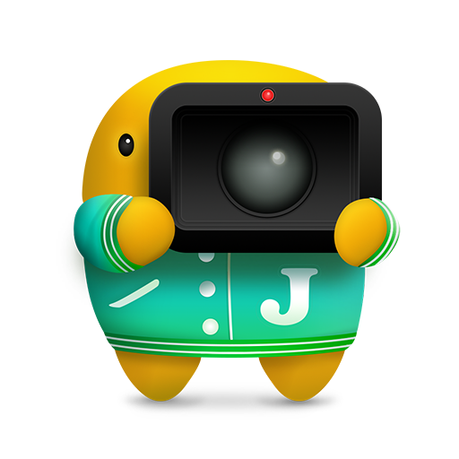

# Jeff

Record your screen as a GIF and share it anywhere with Dropbox.

## Requirements

- OS X 10.10
- A Dropbox account

## Contact

## Maintainers

- [Brandon Evans](https://www.github.com/interstateone) ([@interstateone](https://twitter.com/interstateone))

## License

Copyright 2014 Robots and Pencils. All rights reserved.

Open source code sourced with CocoaPods have their licenses automatically included in the [CocoaPods acknowledgments](Pods/Target%20Support%20Files/Pods/Pods-acknowledgements.markdown) file.
Open source code from other sources are placed in [Libraries](Jeff/Libraries) and include the licenses in their respective folders.
[Gifsicle](http://www.lcdf.org/gifsicle/) is distributed with Jeff as a binary. In compliance with its GPLv2 license you can download the source from [here](https://github.com/RobotsAndPencils/gifsicle/releases/tag/v1.86).